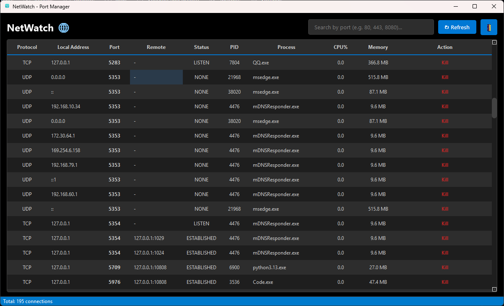

# NetWatch - Windows 端口管理工具

## 下载即用

<p align="center">
  <a href="https://github.com/wangshaojie/NetWatch/releases">
    
  </a>
</p>

<p align="center">
  <b>点击上方按钮或访问 <a href="https://github.com/wangshaojie/NetWatch/releases">Releases 页面</a> 下载编译好的 exe 文件</b><br>
  <span style="color: #718096;">双击即可运行，无需安装 Python 或任何依赖</span>
</p>

---

## 这是什么

NetWatch 是一款面向 Windows 用户的端口管理工具，帮助你查看电脑正在使用哪些网络端口，以及这些端口背后对应的是哪个程序。

## 功能特点

- **实时端口监控**：显示所有 TCP/UDP 端口及其对应进程
- **快速搜索**：支持按端口号模糊搜索
- **安全终止**：系统关键进程受保护，误杀风险
- **主题切换**：支持浅色/深色模式
- **性能优化**：使用 psutil 高效获取数据

---

## 技术架构

```
NetWatch/
├── main.py                    # 应用入口
├── core/
│   ├── theme_manager.py       # 主题管理（浅色/深色）
│   └── single_instance.py      # 单实例控制
├── models/
│   └── port_model.py           # 端口连接数据模型
├── services/
│   ├── port_scanner.py         # 端口扫描服务（基于 psutil）
│   └── process_killer.py       # 进程终止服务
└── ui/
    └── main_window.py          # 主窗口界面
```

### 核心模块

| 模块 | 说明 |
|------|------|
| `PortScanner` | 使用 psutil.net_connections() 获取所有端口连接 |
| `ProcessKiller` | 安全终止进程，支持系统进程保护 |
| `ThemeManager` | 管理浅色/深色主题样式 |
| `PortConnection` | 数据模型，包含端口、进程、CPU、内存等信息 |

### 性能优化

- **异步扫描**：后台线程执行端口扫描，UI 保持响应
- **进程缓存**：避免重复查询进程信息
- **快速 CPU 获取**：使用 10ms 间隔获取 CPU 使用率

---

## 开发与打包

### 环境要求

- Python 3.8+
- Windows 10/11

### 安装依赖

```bash
pip install -r requirements.txt
```

### 运行源码

```bash
python main.py
```

### 打包为 exe

```bash
pyinstaller NetWatch.spec
```

打包后的文件位于 `dist/NetWatch.exe`

---

## 系统进程保护

以下系统进程被列入保护名单，无法被终止：

`system`, `smss.exe`, `csrss.exe`, `wininit.exe`, `services.exe`, `lsass.exe`, `svchost.exe`, `winlogon.exe`, `explorer.exe`, `dllhost.exe`, `rundll32.exe`, `taskmgr.exe`, `winmgmt.exe`, `spoolsv.exe`, `fontdrvhost.exe`, `dwm.exe`, `conhost.exe`, `ctfmon.exe`, `sihost.exe`, `logonui.exe`, `WUDFHost.exe`, `audiodg.exe`, `SearchIndexer.exe`

---

## 界面预览



---

## 更新日志

### v1.1.0
- 使用 psutil 替代 netstat/tasklist，大幅提升性能
- MVC 架构重构
- 添加浅色/深色主题切换
- 优化端口扫描速度

### v1.0.0
- 初始版本
